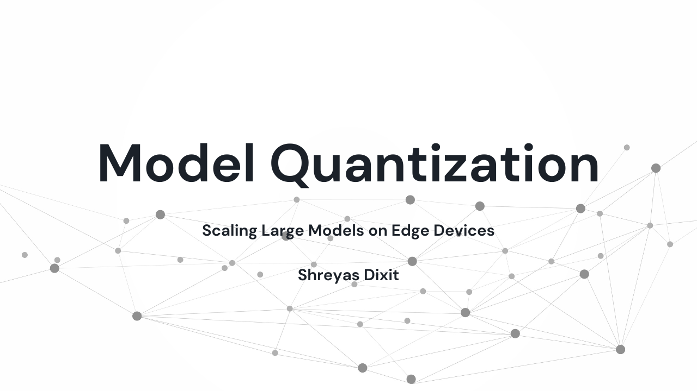

# 🪄 Model Quantization Tutorial

## **Quantization**

Quantization is a technique used to reduce the computational and memory costs of running inference by representing the weights and activations with low-precision data types like 8-bit integer (`int8`) instead of the usual 32-bit floating point (`float32`).

📉 Reducing the number of bits used to represent numbers can lead to significant savings in memory usage and computation time. In many deep learning models, a large portion of the memory and computation resources is dedicated to storing and processing weights and activations. Quantization exploits the fact that often, the full precision of 32-bit floating point numbers is not necessary for achieving accurate results, especially in cases where the input data has inherent noise or uncertainty.

⚖️ Quantization comes with trade-offs. While it reduces memory usage and allows for faster computation, it can also introduce quantization errors that might affect the accuracy of the model. Careful consideration and experimentation are required to strike the right balance between model accuracy and resource efficiency.

## **Theory of Quantization**

Quantization involves mapping continuous values to a discrete set of values. In the context of deep learning, it means representing high-precision floating point numbers with low-precision integers. The process typically consists of the following steps:

1. **Dynamic Range Analysis**: Before quantizing a model, it's important to understand the dynamic range of weights and activations. This involves analyzing the distribution of values to determine the minimum and maximum values they can take.

2. **Choosing the Bitwidth**: The next step is to choose the number of bits to represent the quantized values. Common choices include 8-bit and 4-bit representations. A smaller bitwidth reduces memory usage but might also result in more quantization errors.

3. **Quantization**: During quantization, the continuous floating point values are mapped to the chosen discrete set of integers. This involves rounding the values to the nearest representable integer and applying scaling to cover the desired range.

4. **Quantization-Aware Training**: To mitigate the impact of quantization on model accuracy, quantization-aware training can be employed. This involves fine-tuning the model with quantization constraints, allowing the model to learn parameters that are more resilient to quantization.

5. **Post-training Quantization**: Another approach is post-training quantization, where an already trained model is quantized. This is simpler to implement but might require more aggressive quantization due to the fixed model parameters.

6. **Quantization-Aware Fine-Tuning**: Fine-tuning the quantized model can help recover some of the accuracy lost during quantization.

## **Contributions**

We welcome contributions to enhance and expand this tutorial! If you're interested in contributing, please follow these steps:

1. Fork the repository and clone it to your local machine.
2. Create a new branch for your contributions: `git checkout -b feature/contribution-name`.
3. Make your changes and additions to the tutorial.
4. Commit and push your changes to your forked repository.
5. Create a pull request from your branch to the main repository.

## **Getting Started**

This repository is a template meant to help you get started with model quantization. To try it yourself, follow these steps:

1. Click the "Use this template" button to create a new repository based on this template.
2. Clone your new repository to your local machine.
3. Follow the instructions in the walkthrough notebook ([Quantization_Tutorial notebook](Quantization_Tutorial.ipynb)) to learn and experiment with model quantization.

We hope this tutorial provides you with a solid understanding of quantization and its benefits in optimizing deep learning models for deployment on various platforms.

Happy quantizing! 🚀

